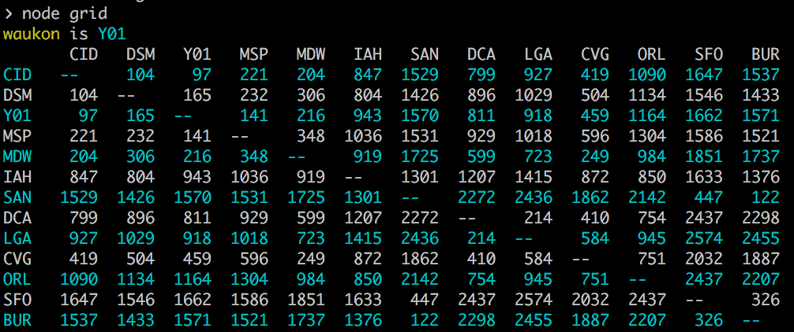
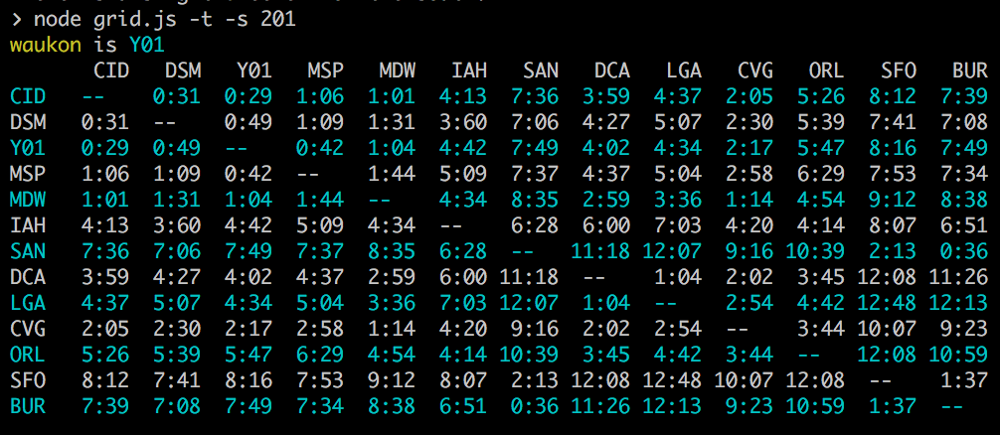
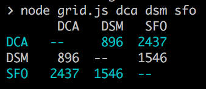

# aviation stuff

**grid.js**

Calculates distances and times between airports.

```sh
node grid.js
```


```sh
node grid.js -t -s 201
```


```sh
node grid.js dca dsm sfo
```



**closest.js**

Finds the closest airports near a lat/lon.
